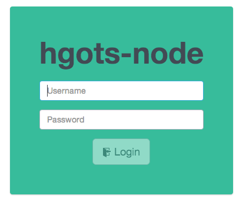
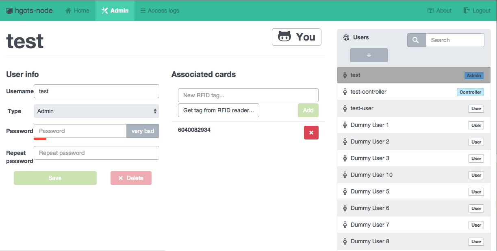
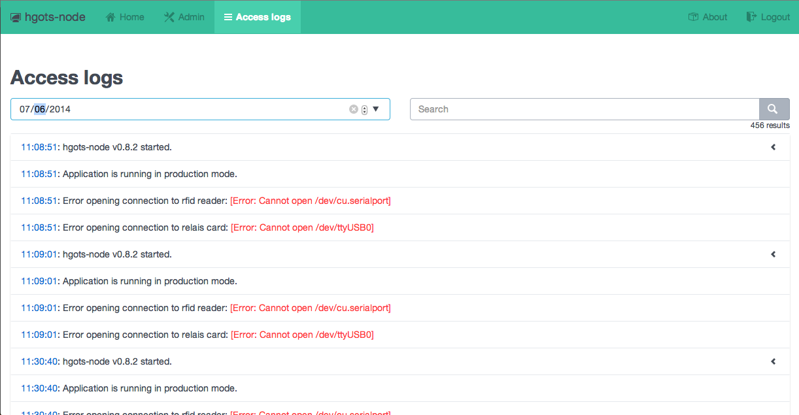

# hgots-node [](https://github.com/sgade/hgots-node/releases)

[](https://travis-ci.org/sgade/hgots-node)
[](https://codeclimate.com/github/sgade/hgots-node)

[](https://david-dm.org/sgade/hgots-node)
[](https://david-dm.org/sgade/hgots-node#info=devDependencies)
[](https://david-dm.org/sgade/hgots-node#info=optionalDependencies)

[](http://gruntjs.com/)

*Door lock system in nodejs for Herbartgymnasium Oldenburg.*

# Screenshots of the web interface

### Login screen
[](README-assets/login.png)

### Admin interface
[](README-assets/admin.png)

### Access logs
[](README-assets/logs.png)


## Applications working with hgots

* Android App with Wear Support: [jhbruhn/HGOTSUMTTM](https://github.com/jhbruhn/HGOTSUMTTM)

# Target environment and usage

This application was written with a [raspberry pi](http://www.raspberrypi.org/) in mind.
The setup this application is tested with:

- 1x [Raspberry PI Model B](http://www.amazon.de/Raspberry-Pi-RBCA000-Mainboard-1176JZF-S/dp/B008PT4GGC/ref=sr_1_1?ie=UTF8&qid=1401914154&sr=8-1&keywords=raspberry+pi)
- 2x [USB to Serial Adapter](http://www.pollin.de/shop/dt/NTY5ODcyOTk-/Computer_und_Zubehoer/Hardware/Kabel_Stecker_Adapter/USB_Adapterkabel_auf_Seriell.html) to connect the Relais card and the RFID reader
- 1x [8-Pin Relais Card](http://www.conrad.de/ce/de/product/197720/Conrad-8fach-Relaiskarte-Baustein-12-24-VDC-8-Relaisausgaenge) to control the door and the LEDs
- 1x [RFID Reader](http://www.pollin.de/shop/dt/NzQ3OTgxOTk-/Bausaetze_Module/Bausaetze/Bausatz_RFID_Reader.html) to allow access via RFID tags
- Accessories, to power the raspberry pi and relais card etc.

# Install process

The install process is pretty easy, even for unexperienced users. All you need is a computer that has the `ssh` command available on the command line. Any GUI SSH client will do but I'm gonna explain everything on the command line.

To start the installation, please prepare your raspberry. Install Raspbian or any other OS and connect the Raspberry Pi to your local network. If you do not know how to do this, there are tons of tutorials out there that explain exactly how to do this.
Once the device is connected to the network, `ssh` into it. This is pretty easy. In the case of raspbian, the default user is called `pi` with the password set to `raspberry`.

1. `ssh pi@ipOfRaspberry`: Connect to the raspberry
2. `apt-get install libavahi-compat-libdnssd-dev`: Install needed dependencies. ___(optional)___
3. `git clone https://github.com/sgade/hgots-node.git`: Clone the repository.
4. `cd hgots-node`: Go into the repository directory.
5. `sh setup.sh`: Run the production setup route.
6. `cp config.example.json config.json`: Copy the example configuration file and create the required one. **You should edit the config.json file to fit your needs!**
7. `node lib/app`: You are ready to launch the application!

## First login

On first start in *production mode* (`env NODE_ENV=production node lib/app` or run `start.sh`), a default login will be created. The credentials for this admin are:

**Username:** `admin`<br>
**Password:** `admin`

It is highly recommended that you **immediately change this password!**

## HTTPS

If you want to enable node's https server, first run `setup/ssl.sh` to create a self-signed certificate or add your official one into the folder `./ssl`. You need to place a file that is called the way your server is accessed (e.g. `localhost.key` and `localhost.crt`).
If you have your certificate(s) ready, go into your `config.json` and set `enableSSL` to `true` and enter your certificate password in `sslCertificatePassphrase`. That's all.

# Technical details

During the setup routine, the raspberry checks for ruby, node and other requirements and even tries to install those. It will tell you if it is not able to resolve any problems by itself.
Applications like `sass` (Ruby gem), `grunt` (npm package) and `bower` (npm package) are installed globally. See [setup.sh](https://github.com/sgade/hgots-node/blob/master/setup.sh) for further details.

## The central configuration

Everything important is defined in the file named `config.json` which is located in the root of the project. You should have created such a file and should be able to edit the details in there with applications like `nano` (-> `nano config.json`).

Explanation:
```javascript
{
  port: { // device paths, this could be usb ports if serial ports are forwarded via usb to serial adapters
    "rfid": "", // path to the rfid reader device
    "relais": "" // path to the relais card
  },
  "relaisport": { // ports on the relais card that are mapped to certain functions:
    "door": 0, // the port to open the door
    "green": 0, // port for green led
    "yellow": 0, // port for yellow led
    "red": 0 // port for red led
  },
  "db": { // config for database
    "name": "db.sqlite", // filename for the database
    "username": "", // credentials for the database
    "password": ""
  },
  "web": {
    "port": 80, // port on which the web interface (either HTTP or HTTPS) is running
    "secret": "x", // a UNIQUE secret that is used to save cookies
    "useBonjour": true, // advertise the web interface via mdns (aka Apple's "Bonjour")
    "enableSSL": false, // enable HTTPS connections. This is working but might be difficult to use. See README for config help.
    "sslCertificatePassphrase": "" // see SSL config
  },
  "doorOpenTime": 2000, // the time in ms that the door will be open
  "logname": "log_%s.log" // name of each log placed in the /logs directory. %s is the current date (yyyy.mm.dd).
}
```


# How to develop

1. `git clone https://github.com/sgade/hgots-node.git`
2. `npm install`
3. `bower install`
4. `grunt dev` and `node lib/app`

## A Note for API developers

This application was designed with no specific frontend in mind. Although it features a web server and an angular UI, it is totally compatible with third party REST consumers. If you discover bugs in the API that are not following the REST guidelines or simply do not work for you, feel free to open an issue.

If you want to create a third-party application for the API server there are some things you should consider:

1. You *should not* sell your application or gain profit from this project, as it is open-source.
2. You *should* link or refer to this repository and indicate that you are only using our work efforts.
3. You *can* contact me if you are interested in being listed here. You application does not have to be open-source (but again, free and without commercial use, i.e. no charges in any form like ads) but it would be nice if it would.
4. If you want to represent certain actions in your application, you should use the icons used in the web application. They were carefully selected and should be used to give the user a sense of coherency. Here's a small list, using the [Github Octicons](https://octicons.github.com/):
  - Sign In: [sign-in](https://octicons.github.com/icon/sign-in/)
  - Sign Out: [sign-out](https://octicons.github.com/icon/sign-out/)
  - Open Door: [key](https://octicons.github.com/icon/key/)
  - About: [package](https://octicons.github.com/icon/package/)
5. Since we are using the MIT Licence, you are free to do what you want with the code but keep in mind that a little referal link is not hard to implement. Please help open source stay nice and open.

# Generate documentation

Use `grunt doc` and look in the `./doc/` directory.

# Contributors
* [@sgade](https://github.com/sgade)
* [@jhbruhn](https://github.com/jhbruhn)

# How to use with nginx (untested)

To use this application behind an nginx-server you should first install nginx with Phusion Passenger enabled (there are a lot of docs for this out there). Your nginx config file should look similar to this:
```
http {
    passenger_root /usr/local/opt/passenger/libexec/lib/phusion_passenger/locations.ini; # get this via "passenger-config --root"
    passenger_ruby /usr/bin/ruby;
    passenger_nodejs /usr/local/bin/node;
    include       mime.types;
    default_type  application/octet-stream;

    sendfile        on;

    keepalive_timeout  65;

    gzip  on;

    server {
        listen       8080; # probably 80
        server_name  localhost;

        passenger_app_root /webapps/hgots-node/; # change this to the root-dir of the app
        root /webapps/hgots-node/lib/web/public/; # and this to the root dir + "/lib/web/public"
        passenger_enabled on;
        passenger_app_type node;
        passenger_startup_file lib/app.js;  
    }

}

```

# License

See `LICENSE` file.
